# Classification Demo Report

This report exercises the binary classification suite from `docs/specs_classification.md`.
The emphasis is on three things:

- scalar metrics that are easy to compare
- visual diagnostics that explain threshold behavior
- synthetic datasets ranging from easy to genuinely messy
- persisted input datasets under `inputs_classification/` for reproducibility
- color-coded input-space visualizations for every dataset

## Global Leaderboard

<table class="dataframe">
  <thead>
    <tr style="text-align: right;">
      <th>dataset</th>
      <th>model</th>
      <th>roc_auc</th>
      <th>pr_auc</th>
      <th>precision</th>
      <th>recall</th>
      <th>js_divergence</th>
      <th>kl_divergence_0_to_1</th>
      <th>kl_divergence_1_to_0</th>
      <th>expected_cost_per_example</th>
      <th>best_cost_threshold</th>
      <th>brier_score</th>
    </tr>
  </thead>
  <tbody>
    <tr>
      <td>easy_separable</td>
      <td>hist_gradient_boosting</td>
      <td>0.9997</td>
      <td>0.9997</td>
      <td>0.9948</td>
      <td>0.9896</td>
      <td>0.6733</td>
      <td>5.9374</td>
      <td>6.0303</td>
      <td>0.0130</td>
      <td>0.1400</td>
      <td>0.0061</td>
    </tr>
    <tr>
      <td>easy_separable</td>
      <td>random_forest</td>
      <td>0.9992</td>
      <td>0.9993</td>
      <td>0.9974</td>
      <td>0.9922</td>
      <td>0.6790</td>
      <td>16.6716</td>
      <td>18.3795</td>
      <td>0.0091</td>
      <td>0.5100</td>
      <td>0.0124</td>
    </tr>
    <tr>
      <td>easy_separable</td>
      <td>logistic_regression</td>
      <td>0.9987</td>
      <td>0.9990</td>
      <td>0.9974</td>
      <td>0.9870</td>
      <td>0.6688</td>
      <td>5.8788</td>
      <td>18.8603</td>
      <td>0.0143</td>
      <td>0.3900</td>
      <td>0.0087</td>
    </tr>
    <tr>
      <td>hard_overlap</td>
      <td>random_forest</td>
      <td>0.8813</td>
      <td>0.8797</td>
      <td>0.8349</td>
      <td>0.7982</td>
      <td>0.2780</td>
      <td>1.3528</td>
      <td>1.3926</td>
      <td>0.2813</td>
      <td>0.4450</td>
      <td>0.1383</td>
    </tr>
    <tr>
      <td>hard_overlap</td>
      <td>hist_gradient_boosting</td>
      <td>0.8661</td>
      <td>0.8597</td>
      <td>0.8284</td>
      <td>0.7939</td>
      <td>0.2535</td>
      <td>1.1347</td>
      <td>1.2237</td>
      <td>0.2890</td>
      <td>0.3050</td>
      <td>0.1476</td>
    </tr>
    <tr>
      <td>hard_overlap</td>
      <td>logistic_regression</td>
      <td>0.7086</td>
      <td>0.7162</td>
      <td>0.6674</td>
      <td>0.6645</td>
      <td>0.0796</td>
      <td>0.3160</td>
      <td>0.3739</td>
      <td>0.5022</td>
      <td>0.3550</td>
      <td>0.2184</td>
    </tr>
    <tr>
      <td>imbalanced_linear</td>
      <td>hist_gradient_boosting</td>
      <td>0.9213</td>
      <td>0.7911</td>
      <td>0.9194</td>
      <td>0.5816</td>
      <td>0.3550</td>
      <td>1.4120</td>
      <td>5.9281</td>
      <td>0.1875</td>
      <td>0.0800</td>
      <td>0.0349</td>
    </tr>
    <tr>
      <td>imbalanced_linear</td>
      <td>random_forest</td>
      <td>0.9041</td>
      <td>0.7341</td>
      <td>0.9111</td>
      <td>0.4184</td>
      <td>0.3519</td>
      <td>1.4962</td>
      <td>5.4386</td>
      <td>0.2580</td>
      <td>0.1650</td>
      <td>0.0440</td>
    </tr>
    <tr>
      <td>imbalanced_linear</td>
      <td>logistic_regression</td>
      <td>0.9016</td>
      <td>0.6822</td>
      <td>0.7797</td>
      <td>0.4694</td>
      <td>0.3007</td>
      <td>1.1815</td>
      <td>4.6373</td>
      <td>0.2437</td>
      <td>0.1950</td>
      <td>0.0445</td>
    </tr>
    <tr>
      <td>nonlinear_moons</td>
      <td>hist_gradient_boosting</td>
      <td>0.9667</td>
      <td>0.9638</td>
      <td>0.8967</td>
      <td>0.9095</td>
      <td>0.4673</td>
      <td>2.6862</td>
      <td>2.7694</td>
      <td>0.1429</td>
      <td>0.2100</td>
      <td>0.0715</td>
    </tr>
    <tr>
      <td>nonlinear_moons</td>
      <td>random_forest</td>
      <td>0.9676</td>
      <td>0.9615</td>
      <td>0.9194</td>
      <td>0.9238</td>
      <td>0.4880</td>
      <td>3.2596</td>
      <td>2.8367</td>
      <td>0.1167</td>
      <td>0.4600</td>
      <td>0.0611</td>
    </tr>
    <tr>
      <td>nonlinear_moons</td>
      <td>logistic_regression</td>
      <td>0.9341</td>
      <td>0.9290</td>
      <td>0.8485</td>
      <td>0.8667</td>
      <td>0.3744</td>
      <td>2.4913</td>
      <td>2.0504</td>
      <td>0.2107</td>
      <td>0.2400</td>
      <td>0.1019</td>
    </tr>
  </tbody>
</table>

## Reading Guide

- `ROC-AUC` and `PR-AUC` tell the ranking story.
- `JSD` tells the class-separation story and is mandatory in this suite.
- `KL` is included as a directional diagnostic, not the primary separation metric.
- expected cost and best-cost threshold tell the deployment story.

## Dataset: easy_separable

For `easy_separable`, the strongest overall story came from `hist_gradient_boosting` with PR-AUC=1.000, ROC-AUC=1.000, and JSD=0.673. The table below shows how the models trade ranking quality, threshold behavior, and score-distribution separation.

Input data for this dataset: [`easy_separable.csv`](../inputs_classification/easy_separable.csv)

Input projection: [`easy_separable_projection.csv`](../inputs_classification/easy_separable_projection.csv)

Input visualization method: `tsne_2d`

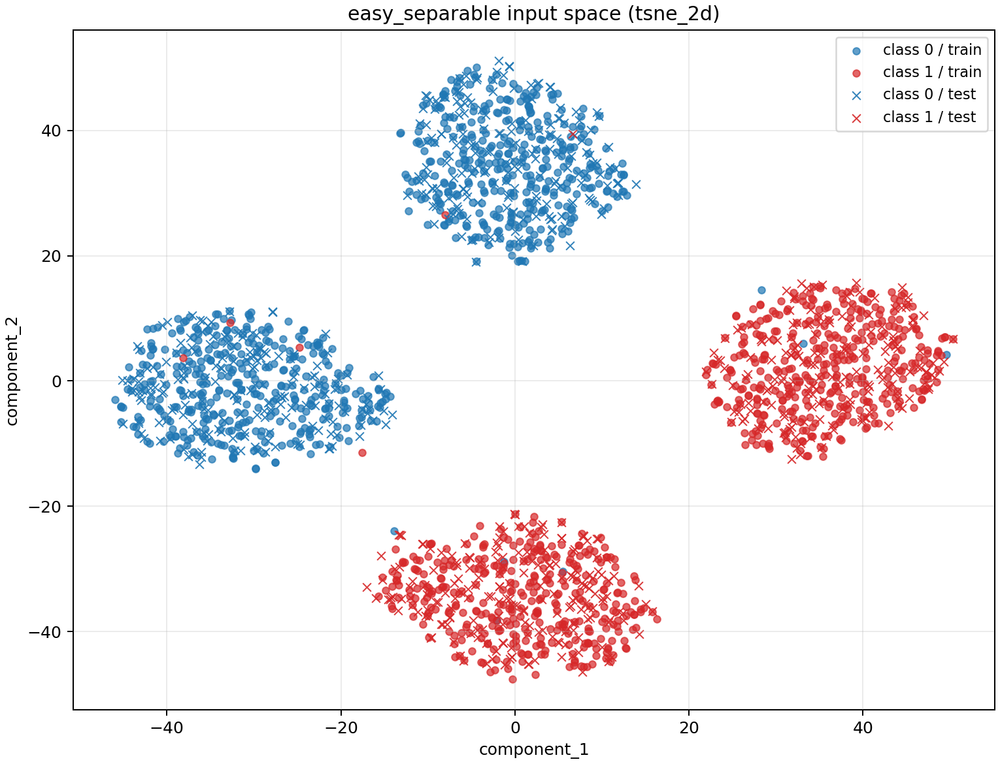

<table class="dataframe">
  <thead>
    <tr style="text-align: right;">
      <th>model</th>
      <th>roc_auc</th>
      <th>pr_auc</th>
      <th>precision</th>
      <th>recall</th>
      <th>js_divergence</th>
      <th>expected_cost_per_example</th>
      <th>best_cost_threshold</th>
      <th>brier_score</th>
    </tr>
  </thead>
  <tbody>
    <tr>
      <td>hist_gradient_boosting</td>
      <td>0.9997</td>
      <td>0.9997</td>
      <td>0.9948</td>
      <td>0.9896</td>
      <td>0.6733</td>
      <td>0.0130</td>
      <td>0.1400</td>
      <td>0.0061</td>
    </tr>
    <tr>
      <td>random_forest</td>
      <td>0.9992</td>
      <td>0.9993</td>
      <td>0.9974</td>
      <td>0.9922</td>
      <td>0.6790</td>
      <td>0.0091</td>
      <td>0.5100</td>
      <td>0.0124</td>
    </tr>
    <tr>
      <td>logistic_regression</td>
      <td>0.9987</td>
      <td>0.9990</td>
      <td>0.9974</td>
      <td>0.9870</td>
      <td>0.6688</td>
      <td>0.0143</td>
      <td>0.3900</td>
      <td>0.0087</td>
    </tr>
  </tbody>
</table>

### Metric Narratives

- easy_separable / logistic_regression: ROC-AUC=0.999, PR-AUC=0.999, JSD=0.669. The model shows excellent ranking separation, and class score distributions are clearly separated. At threshold 0.500, precision=0.997 and recall=0.987; the chosen threshold leaves measurable cost on the table; switching to 0.390 would reduce cost per example by 0.0026.
- easy_separable / random_forest: ROC-AUC=0.999, PR-AUC=0.999, JSD=0.679. The model shows excellent ranking separation, and class score distributions are clearly separated. At threshold 0.500, precision=0.997 and recall=0.992; the chosen threshold is already cost-optimal on this sample.
- easy_separable / hist_gradient_boosting: ROC-AUC=1.000, PR-AUC=1.000, JSD=0.673. The model shows excellent ranking separation, and class score distributions are clearly separated. At threshold 0.500, precision=0.995 and recall=0.990; the chosen threshold leaves measurable cost on the table; switching to 0.140 would reduce cost per example by 0.0052.

### Figures

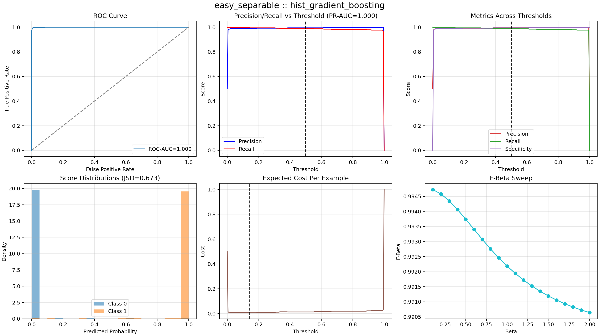
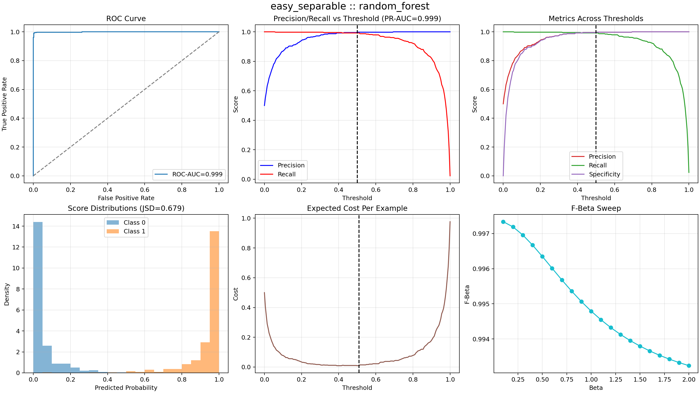
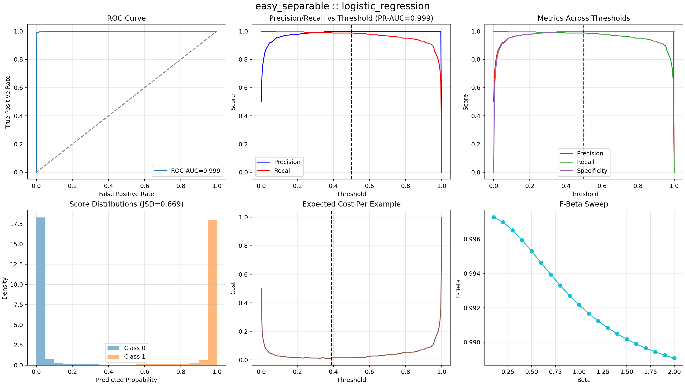

## Dataset: imbalanced_linear

For `imbalanced_linear`, the strongest overall story came from `hist_gradient_boosting` with PR-AUC=0.791, ROC-AUC=0.921, and JSD=0.355. The table below shows how the models trade ranking quality, threshold behavior, and score-distribution separation.

Input data for this dataset: [`imbalanced_linear.csv`](../inputs_classification/imbalanced_linear.csv)

Input projection: [`imbalanced_linear_projection.csv`](../inputs_classification/imbalanced_linear_projection.csv)

Input visualization method: `tsne_2d`

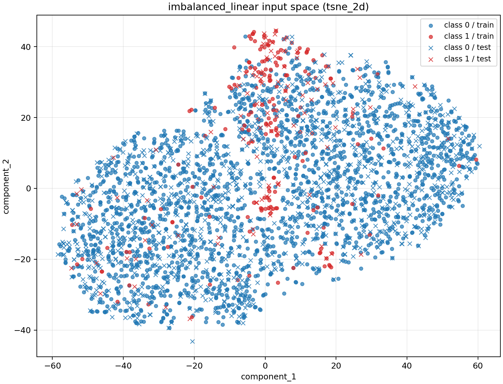

<table class="dataframe">
  <thead>
    <tr style="text-align: right;">
      <th>model</th>
      <th>roc_auc</th>
      <th>pr_auc</th>
      <th>precision</th>
      <th>recall</th>
      <th>js_divergence</th>
      <th>expected_cost_per_example</th>
      <th>best_cost_threshold</th>
      <th>brier_score</th>
    </tr>
  </thead>
  <tbody>
    <tr>
      <td>hist_gradient_boosting</td>
      <td>0.9213</td>
      <td>0.7911</td>
      <td>0.9194</td>
      <td>0.5816</td>
      <td>0.3550</td>
      <td>0.1875</td>
      <td>0.0800</td>
      <td>0.0349</td>
    </tr>
    <tr>
      <td>random_forest</td>
      <td>0.9041</td>
      <td>0.7341</td>
      <td>0.9111</td>
      <td>0.4184</td>
      <td>0.3519</td>
      <td>0.2580</td>
      <td>0.1650</td>
      <td>0.0440</td>
    </tr>
    <tr>
      <td>logistic_regression</td>
      <td>0.9016</td>
      <td>0.6822</td>
      <td>0.7797</td>
      <td>0.4694</td>
      <td>0.3007</td>
      <td>0.2437</td>
      <td>0.1950</td>
      <td>0.0445</td>
    </tr>
  </tbody>
</table>

### Metric Narratives

- imbalanced_linear / logistic_regression: ROC-AUC=0.902, PR-AUC=0.682, JSD=0.301. The model shows excellent ranking separation, and class score distributions are only moderately separated. At threshold 0.500, precision=0.780 and recall=0.469; the chosen threshold leaves measurable cost on the table; switching to 0.195 would reduce cost per example by 0.0705.
- imbalanced_linear / random_forest: ROC-AUC=0.904, PR-AUC=0.734, JSD=0.352. The model shows excellent ranking separation, and class score distributions are clearly separated. At threshold 0.500, precision=0.911 and recall=0.418; the chosen threshold leaves measurable cost on the table; switching to 0.165 would reduce cost per example by 0.1045.
- imbalanced_linear / hist_gradient_boosting: ROC-AUC=0.921, PR-AUC=0.791, JSD=0.355. The model shows excellent ranking separation, and class score distributions are clearly separated. At threshold 0.500, precision=0.919 and recall=0.582; the chosen threshold leaves measurable cost on the table; switching to 0.080 would reduce cost per example by 0.0545.

### Figures

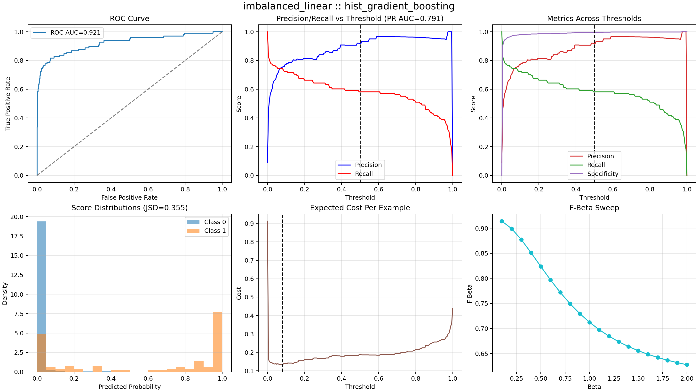
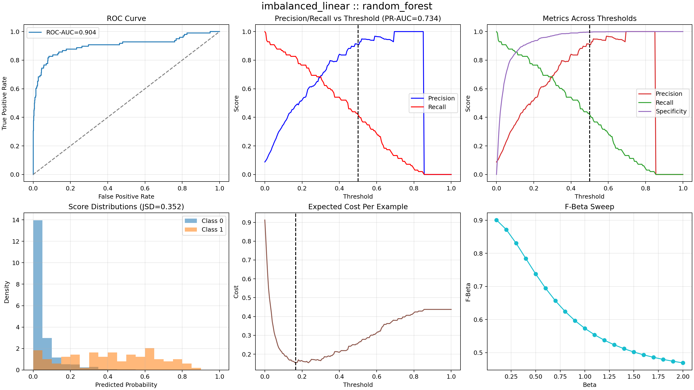
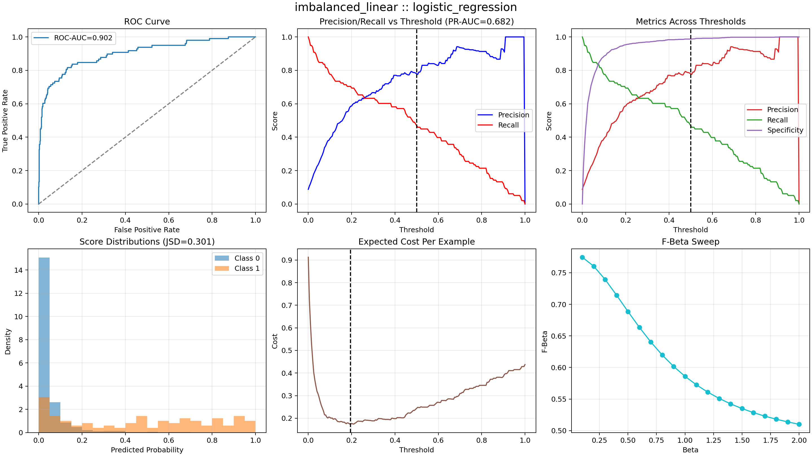

## Dataset: nonlinear_moons

For `nonlinear_moons`, the strongest overall story came from `hist_gradient_boosting` with PR-AUC=0.964, ROC-AUC=0.967, and JSD=0.467. The table below shows how the models trade ranking quality, threshold behavior, and score-distribution separation.

Input data for this dataset: [`nonlinear_moons.csv`](../inputs_classification/nonlinear_moons.csv)

Input projection: [`nonlinear_moons_projection.csv`](../inputs_classification/nonlinear_moons_projection.csv)

Input visualization method: `raw_2d`

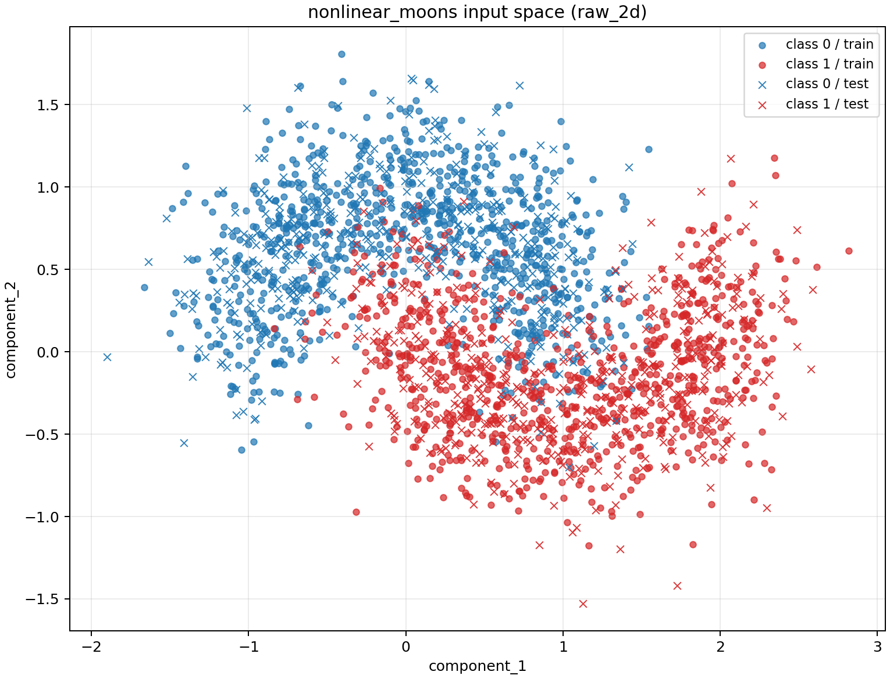

<table class="dataframe">
  <thead>
    <tr style="text-align: right;">
      <th>model</th>
      <th>roc_auc</th>
      <th>pr_auc</th>
      <th>precision</th>
      <th>recall</th>
      <th>js_divergence</th>
      <th>expected_cost_per_example</th>
      <th>best_cost_threshold</th>
      <th>brier_score</th>
    </tr>
  </thead>
  <tbody>
    <tr>
      <td>hist_gradient_boosting</td>
      <td>0.9667</td>
      <td>0.9638</td>
      <td>0.8967</td>
      <td>0.9095</td>
      <td>0.4673</td>
      <td>0.1429</td>
      <td>0.2100</td>
      <td>0.0715</td>
    </tr>
    <tr>
      <td>random_forest</td>
      <td>0.9676</td>
      <td>0.9615</td>
      <td>0.9194</td>
      <td>0.9238</td>
      <td>0.4880</td>
      <td>0.1167</td>
      <td>0.4600</td>
      <td>0.0611</td>
    </tr>
    <tr>
      <td>logistic_regression</td>
      <td>0.9341</td>
      <td>0.9290</td>
      <td>0.8485</td>
      <td>0.8667</td>
      <td>0.3744</td>
      <td>0.2107</td>
      <td>0.2400</td>
      <td>0.1019</td>
    </tr>
  </tbody>
</table>

### Metric Narratives

- nonlinear_moons / logistic_regression: ROC-AUC=0.934, PR-AUC=0.929, JSD=0.374. The model shows excellent ranking separation, and class score distributions are clearly separated. At threshold 0.500, precision=0.848 and recall=0.867; the chosen threshold leaves measurable cost on the table; switching to 0.240 would reduce cost per example by 0.0214.
- nonlinear_moons / random_forest: ROC-AUC=0.968, PR-AUC=0.961, JSD=0.488. The model shows excellent ranking separation, and class score distributions are clearly separated. At threshold 0.500, precision=0.919 and recall=0.924; the chosen threshold leaves measurable cost on the table; switching to 0.460 would reduce cost per example by 0.0071.
- nonlinear_moons / hist_gradient_boosting: ROC-AUC=0.967, PR-AUC=0.964, JSD=0.467. The model shows excellent ranking separation, and class score distributions are clearly separated. At threshold 0.500, precision=0.897 and recall=0.910; the chosen threshold leaves measurable cost on the table; switching to 0.210 would reduce cost per example by 0.0167.

### Figures

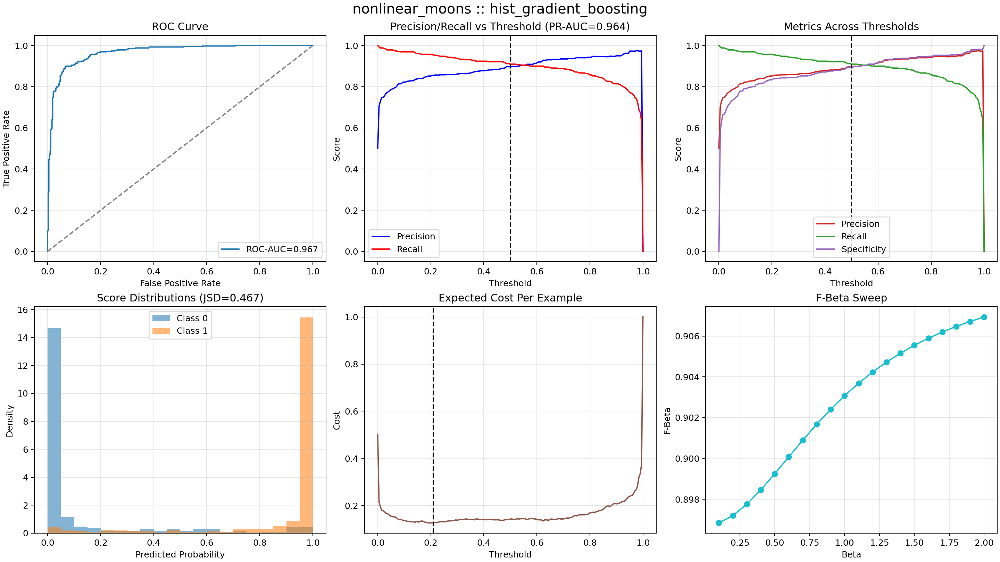
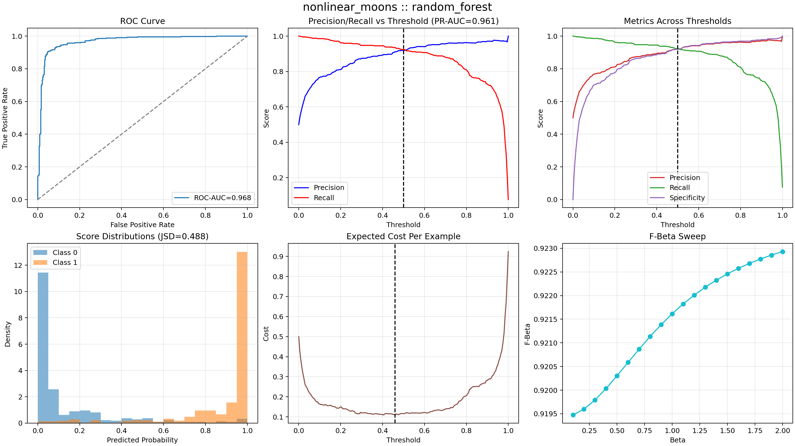
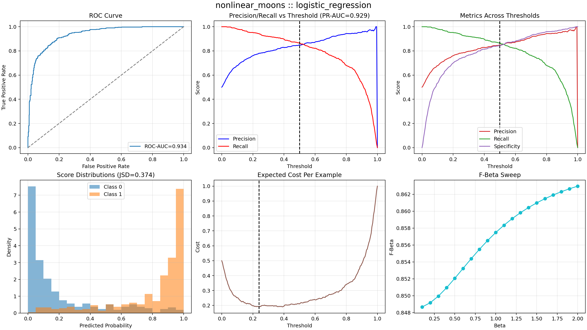

## Dataset: hard_overlap

For `hard_overlap`, the strongest overall story came from `random_forest` with PR-AUC=0.880, ROC-AUC=0.881, and JSD=0.278. The table below shows how the models trade ranking quality, threshold behavior, and score-distribution separation.

Input data for this dataset: [`hard_overlap.csv`](../inputs_classification/hard_overlap.csv)

Input projection: [`hard_overlap_projection.csv`](../inputs_classification/hard_overlap_projection.csv)

Input visualization method: `tsne_2d`

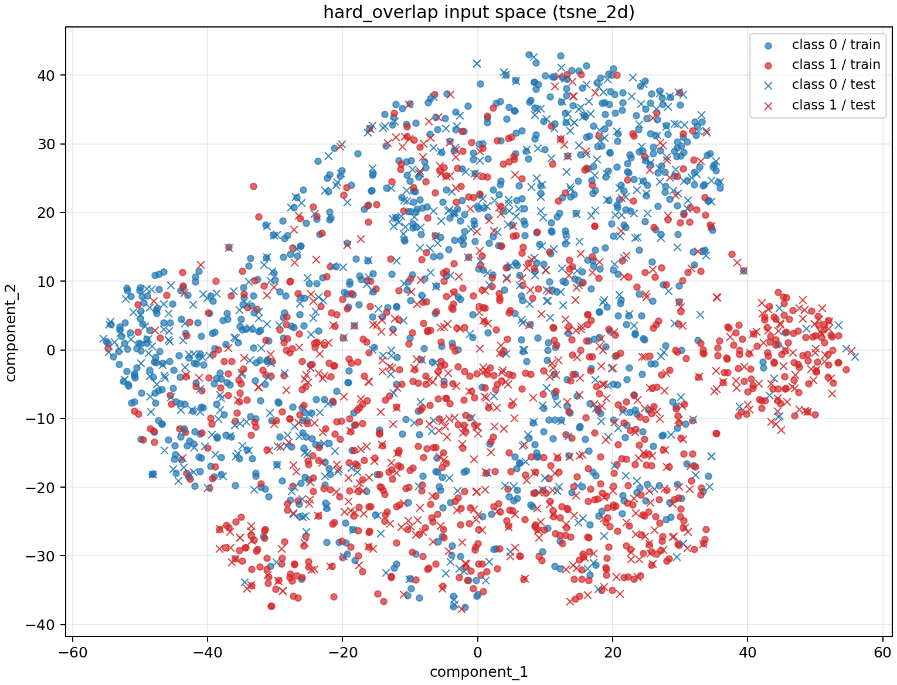

<table class="dataframe">
  <thead>
    <tr style="text-align: right;">
      <th>model</th>
      <th>roc_auc</th>
      <th>pr_auc</th>
      <th>precision</th>
      <th>recall</th>
      <th>js_divergence</th>
      <th>expected_cost_per_example</th>
      <th>best_cost_threshold</th>
      <th>brier_score</th>
    </tr>
  </thead>
  <tbody>
    <tr>
      <td>random_forest</td>
      <td>0.8813</td>
      <td>0.8797</td>
      <td>0.8349</td>
      <td>0.7982</td>
      <td>0.2780</td>
      <td>0.2813</td>
      <td>0.4450</td>
      <td>0.1383</td>
    </tr>
    <tr>
      <td>hist_gradient_boosting</td>
      <td>0.8661</td>
      <td>0.8597</td>
      <td>0.8284</td>
      <td>0.7939</td>
      <td>0.2535</td>
      <td>0.2890</td>
      <td>0.3050</td>
      <td>0.1476</td>
    </tr>
    <tr>
      <td>logistic_regression</td>
      <td>0.7086</td>
      <td>0.7162</td>
      <td>0.6674</td>
      <td>0.6645</td>
      <td>0.0796</td>
      <td>0.5022</td>
      <td>0.3550</td>
      <td>0.2184</td>
    </tr>
  </tbody>
</table>

### Metric Narratives

- hard_overlap / logistic_regression: ROC-AUC=0.709, PR-AUC=0.716, JSD=0.080. The model shows usable but imperfect ranking separation, and class score distributions overlap heavily. At threshold 0.500, precision=0.667 and recall=0.664; the chosen threshold leaves measurable cost on the table; switching to 0.355 would reduce cost per example by 0.0407.
- hard_overlap / random_forest: ROC-AUC=0.881, PR-AUC=0.880, JSD=0.278. The model shows strong ranking separation, and class score distributions are only moderately separated. At threshold 0.500, precision=0.835 and recall=0.798; the chosen threshold leaves measurable cost on the table; switching to 0.445 would reduce cost per example by 0.0330.
- hard_overlap / hist_gradient_boosting: ROC-AUC=0.866, PR-AUC=0.860, JSD=0.254. The model shows strong ranking separation, and class score distributions are only moderately separated. At threshold 0.500, precision=0.828 and recall=0.794; the chosen threshold leaves measurable cost on the table; switching to 0.305 would reduce cost per example by 0.0297.

### Figures

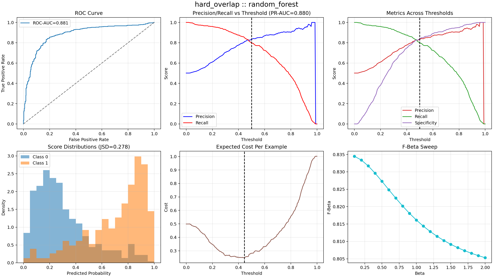
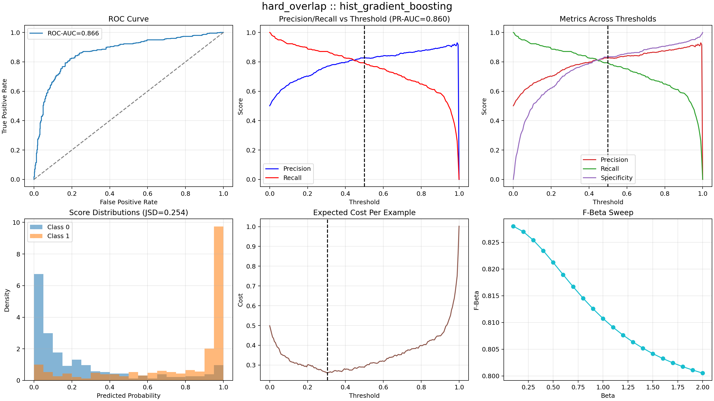
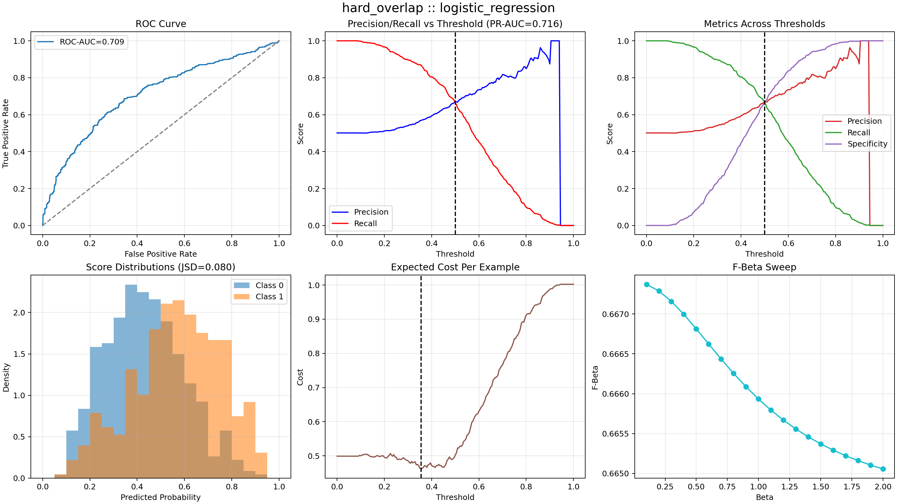
