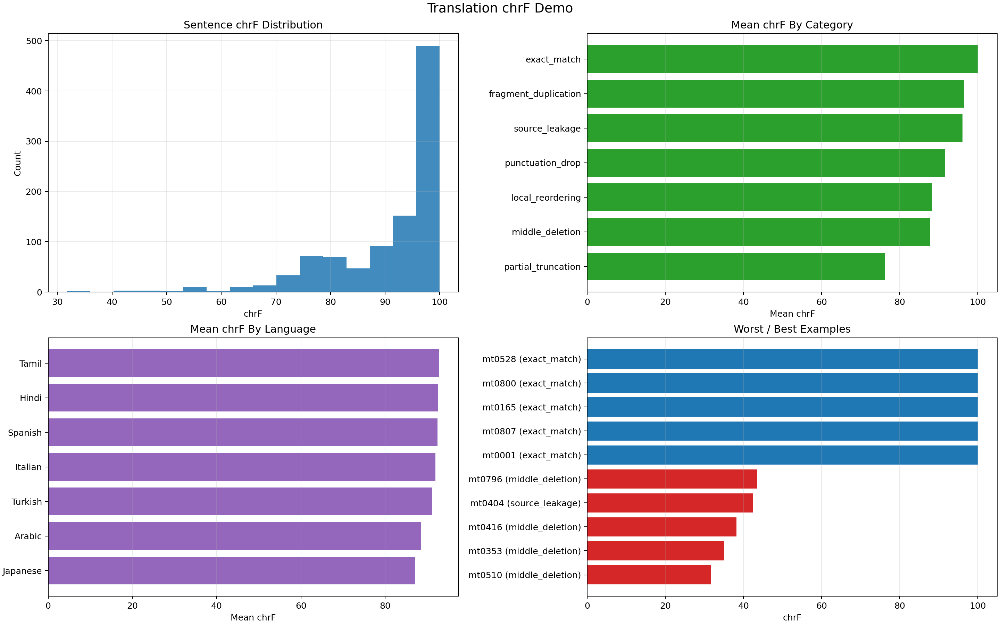

# Translation Demo Report

This report uses `sacrebleu` as the scoring engine for `chrF`.

Input benchmark: [`translation_benchmark.csv`](../inputs_translation/translation_benchmark.csv)

## Summary

<table class="dataframe">
  <thead>
    <tr style="text-align: right;">
      <th>chrf</th>
      <th>num_examples</th>
      <th>char_order</th>
      <th>beta</th>
      <th>lowercase</th>
      <th>whitespace</th>
      <th>eps_smoothing</th>
      <th>mean_sentence_chrf</th>
      <th>median_sentence_chrf</th>
      <th>min_sentence_chrf</th>
      <th>max_sentence_chrf</th>
      <th>signature</th>
    </tr>
  </thead>
  <tbody>
    <tr>
      <td>93.54</td>
      <td>1000</td>
      <td>6</td>
      <td>2</td>
      <td>False</td>
      <td>False</td>
      <td>False</td>
      <td>90.88</td>
      <td>95.55</td>
      <td>31.71</td>
      <td>100.00</td>
      <td>nrefs:1|case:mixed|eff:yes|nc:6|nw:0|space:no|version:2.6.0</td>
    </tr>
  </tbody>
</table>

## Category Summary

<table class="dataframe">
  <thead>
    <tr style="text-align: right;">
      <th>category</th>
      <th>num_examples</th>
      <th>mean_chrf</th>
      <th>median_chrf</th>
      <th>min_chrf</th>
      <th>max_chrf</th>
    </tr>
  </thead>
  <tbody>
    <tr>
      <td>exact_match</td>
      <td>147</td>
      <td>100.00</td>
      <td>100.00</td>
      <td>100.00</td>
      <td>100.00</td>
    </tr>
    <tr>
      <td>fragment_duplication</td>
      <td>140</td>
      <td>96.41</td>
      <td>98.47</td>
      <td>49.28</td>
      <td>99.86</td>
    </tr>
    <tr>
      <td>source_leakage</td>
      <td>140</td>
      <td>96.10</td>
      <td>97.79</td>
      <td>42.50</td>
      <td>99.73</td>
    </tr>
    <tr>
      <td>punctuation_drop</td>
      <td>147</td>
      <td>91.50</td>
      <td>93.09</td>
      <td>63.24</td>
      <td>100.00</td>
    </tr>
    <tr>
      <td>local_reordering</td>
      <td>140</td>
      <td>88.35</td>
      <td>92.19</td>
      <td>47.94</td>
      <td>100.00</td>
    </tr>
    <tr>
      <td>middle_deletion</td>
      <td>140</td>
      <td>87.79</td>
      <td>91.97</td>
      <td>31.71</td>
      <td>99.02</td>
    </tr>
    <tr>
      <td>partial_truncation</td>
      <td>146</td>
      <td>76.16</td>
      <td>77.07</td>
      <td>44.19</td>
      <td>100.00</td>
    </tr>
  </tbody>
</table>

## Language Summary

<table class="dataframe">
  <thead>
    <tr style="text-align: right;">
      <th>language</th>
      <th>num_examples</th>
      <th>mean_chrf</th>
      <th>median_chrf</th>
      <th>min_chrf</th>
      <th>max_chrf</th>
    </tr>
  </thead>
  <tbody>
    <tr>
      <td>Tamil</td>
      <td>142</td>
      <td>92.71</td>
      <td>96.33</td>
      <td>55.21</td>
      <td>100.00</td>
    </tr>
    <tr>
      <td>Hindi</td>
      <td>143</td>
      <td>92.50</td>
      <td>96.75</td>
      <td>63.35</td>
      <td>100.00</td>
    </tr>
    <tr>
      <td>Spanish</td>
      <td>143</td>
      <td>92.37</td>
      <td>95.91</td>
      <td>45.30</td>
      <td>100.00</td>
    </tr>
    <tr>
      <td>Italian</td>
      <td>143</td>
      <td>91.89</td>
      <td>96.35</td>
      <td>44.19</td>
      <td>100.00</td>
    </tr>
    <tr>
      <td>Turkish</td>
      <td>143</td>
      <td>91.15</td>
      <td>95.14</td>
      <td>31.71</td>
      <td>100.00</td>
    </tr>
    <tr>
      <td>Arabic</td>
      <td>143</td>
      <td>88.52</td>
      <td>93.64</td>
      <td>43.53</td>
      <td>100.00</td>
    </tr>
    <tr>
      <td>Japanese</td>
      <td>143</td>
      <td>87.03</td>
      <td>92.10</td>
      <td>35.01</td>
      <td>100.00</td>
    </tr>
  </tbody>
</table>

## Best Examples

<table class="dataframe">
  <thead>
    <tr style="text-align: right;">
      <th>id</th>
      <th>language</th>
      <th>category</th>
      <th>source</th>
      <th>reference</th>
      <th>candidate</th>
      <th>chrf</th>
    </tr>
  </thead>
  <tbody>
    <tr>
      <td>mt0001</td>
      <td>Spanish</td>
      <td>exact_match</td>
      <td>The new restrictions disproportionately affect young people, minorities and people with low incomes.</td>
      <td>Con lo cual, las nuevas restricciones afectan de manera desproporcionada a los jóvenes, las minorías y las personas con ingresos bajos.</td>
      <td>Con lo cual, las nuevas restricciones afectan de manera desproporcionada a los jóvenes, las minorías y las personas con ingresos bajos.</td>
      <td>100.00</td>
    </tr>
    <tr>
      <td>mt0807</td>
      <td>Arabic</td>
      <td>exact_match</td>
      <td>There's restricted economic activity.</td>
      <td>هناك نشاط اقتصادي مقيد.</td>
      <td>هناك نشاط اقتصادي مقيد.</td>
      <td>100.00</td>
    </tr>
    <tr>
      <td>mt0165</td>
      <td>Italian</td>
      <td>exact_match</td>
      <td>However, nor do any legal enactments prohibit the transporters from providing services.</td>
      <td>Nessuna regolazione però vieta al trasportatore di effettuare i servizi.</td>
      <td>Nessuna regolazione però vieta al trasportatore di effettuare i servizi.</td>
      <td>100.00</td>
    </tr>
    <tr>
      <td>mt0800</td>
      <td>Arabic</td>
      <td>exact_match</td>
      <td>And I said, "Oh, it's water in air."</td>
      <td>فقلت, "ها, إنها الماء الذي في الهواء."</td>
      <td>فقلت, "ها, إنها الماء الذي في الهواء."</td>
      <td>100.00</td>
    </tr>
    <tr>
      <td>mt0528</td>
      <td>Turkish</td>
      <td>exact_match</td>
      <td>Prof. Dr. Çağlar "One shouldn’t be diving into water into which they can’t see".</td>
      <td>Prof. Dr. Çağlar, "İçi görülemeyen suya balıklama atlanmamalı."</td>
      <td>Prof. Dr. Çağlar, "İçi görülemeyen suya balıklama atlanmamalı."</td>
      <td>100.00</td>
    </tr>
    <tr>
      <td>mt0793</td>
      <td>Arabic</td>
      <td>exact_match</td>
      <td>Beautiful, white roots, deep, green colors and a monthly harvest.</td>
      <td>جذور بيضاء جميلة, ألوان خضراء عميقة و حصاد شهري.</td>
      <td>جذور بيضاء جميلة, ألوان خضراء عميقة و حصاد شهري.</td>
      <td>100.00</td>
    </tr>
    <tr>
      <td>mt0786</td>
      <td>Arabic</td>
      <td>exact_match</td>
      <td>Two months?</td>
      <td>شهرين؟</td>
      <td>شهرين؟</td>
      <td>100.00</td>
    </tr>
    <tr>
      <td>mt0172</td>
      <td>Italian</td>
      <td>exact_match</td>
      <td>The stuff looks weird and has a completely novel taste.</td>
      <td>Le cose sembrano strane e hanno un sapore completamente nuovo.</td>
      <td>Le cose sembrano strane e hanno un sapore completamente nuovo.</td>
      <td>100.00</td>
    </tr>
    <tr>
      <td>mt0779</td>
      <td>Arabic</td>
      <td>exact_match</td>
      <td>But if I'm being honest, it also spread because I fought to spread it.</td>
      <td>ولكن حتى أكون صادقًا، لقد انتشرت لأنني حاربت كي تنتشر.</td>
      <td>ولكن حتى أكون صادقًا، لقد انتشرت لأنني حاربت كي تنتشر.</td>
      <td>100.00</td>
    </tr>
    <tr>
      <td>mt0373</td>
      <td>Japanese</td>
      <td>partial_truncation</td>
      <td>🙌</td>
      <td>🙌</td>
      <td>🙌</td>
      <td>100.00</td>
    </tr>
  </tbody>
</table>

## Worst Examples

<table class="dataframe">
  <thead>
    <tr style="text-align: right;">
      <th>id</th>
      <th>language</th>
      <th>category</th>
      <th>source</th>
      <th>reference</th>
      <th>candidate</th>
      <th>chrf</th>
    </tr>
  </thead>
  <tbody>
    <tr>
      <td>mt0510</td>
      <td>Turkish</td>
      <td>middle_deletion</td>
      <td>Two mysterious deaths</td>
      <td>İki sır ölüm</td>
      <td>İki ölüm</td>
      <td>31.71</td>
    </tr>
    <tr>
      <td>mt0353</td>
      <td>Japanese</td>
      <td>middle_deletion</td>
      <td>@user2</td>
      <td>@user2</td>
      <td>@usr2</td>
      <td>35.01</td>
    </tr>
    <tr>
      <td>mt0416</td>
      <td>Japanese</td>
      <td>middle_deletion</td>
      <td>Easel</td>
      <td>イーゼル</td>
      <td>イール</td>
      <td>38.24</td>
    </tr>
    <tr>
      <td>mt0404</td>
      <td>Japanese</td>
      <td>source_leakage</td>
      <td>DETONATION</td>
      <td>爆発</td>
      <td>爆発 DETONATION</td>
      <td>42.50</td>
    </tr>
    <tr>
      <td>mt0796</td>
      <td>Arabic</td>
      <td>middle_deletion</td>
      <td>And then we built it.</td>
      <td>ثم صنعناه.</td>
      <td>ثم صنناه.</td>
      <td>43.53</td>
    </tr>
    <tr>
      <td>mt0153</td>
      <td>Italian</td>
      <td>partial_truncation</td>
      <td>The prices are also not among the lowest.</td>
      <td>I prezzi non sono proprio bassissimi.</td>
      <td>I prezzi non sono</td>
      <td>44.19</td>
    </tr>
    <tr>
      <td>mt0074</td>
      <td>Spanish</td>
      <td>middle_deletion</td>
      <td>You have no money?</td>
      <td>¿No tiene dinero?</td>
      <td>¿No dinero?</td>
      <td>45.30</td>
    </tr>
    <tr>
      <td>mt0146</td>
      <td>Italian</td>
      <td>partial_truncation</td>
      <td>A signal for Asian trading</td>
      <td>Il Segnale per il commercio asiatico</td>
      <td>Il Segnale per il</td>
      <td>45.59</td>
    </tr>
    <tr>
      <td>mt0734</td>
      <td>Arabic</td>
      <td>local_reordering</td>
      <td>Thank you so much.</td>
      <td>شكرا جزيلا لك.</td>
      <td>جزيشكرالا لك.</td>
      <td>47.94</td>
    </tr>
    <tr>
      <td>mt0377</td>
      <td>Japanese</td>
      <td>fragment_duplication</td>
      <td>yeeee!</td>
      <td>やったーっ！</td>
      <td>やったーーっ！</td>
      <td>49.28</td>
    </tr>
  </tbody>
</table>

## Plot

